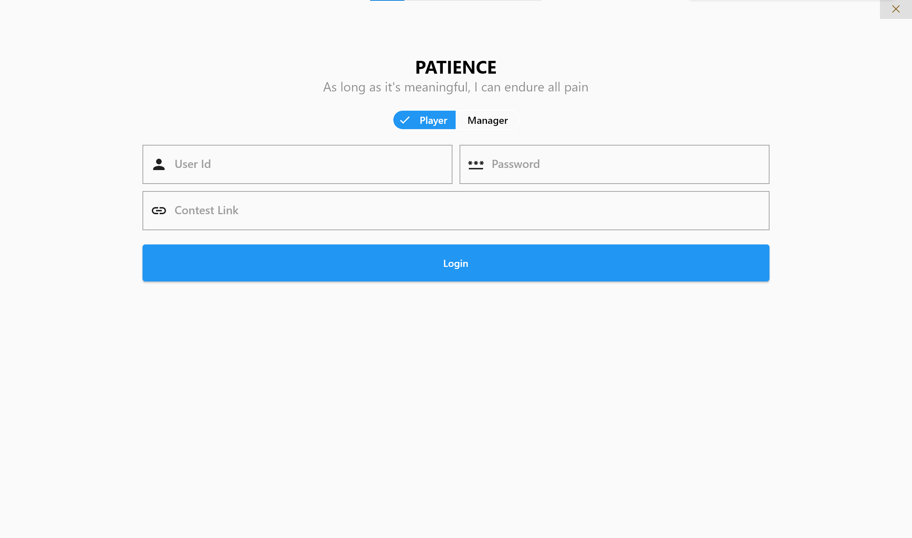
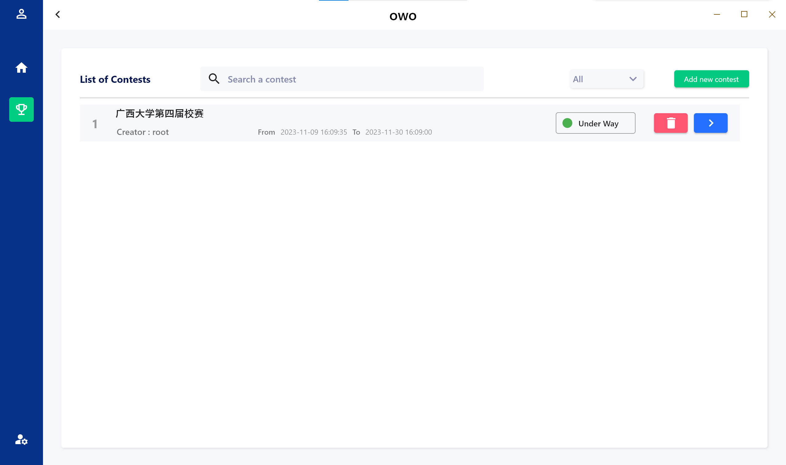
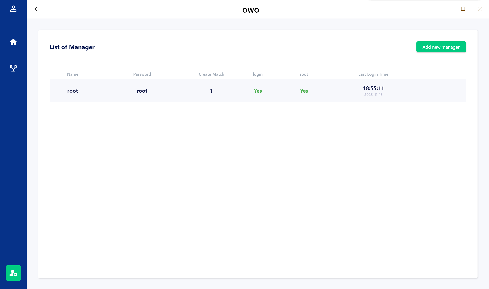
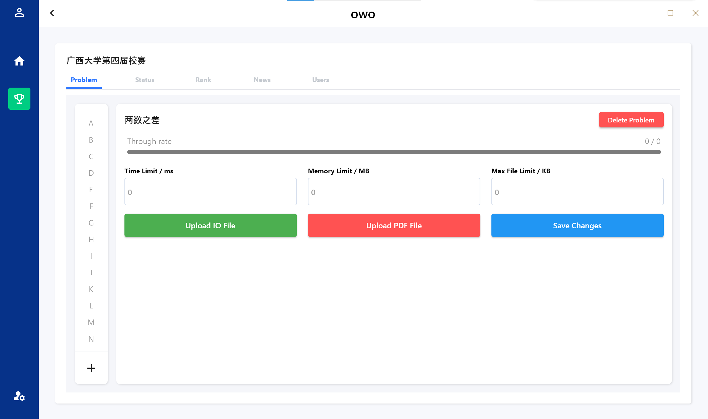
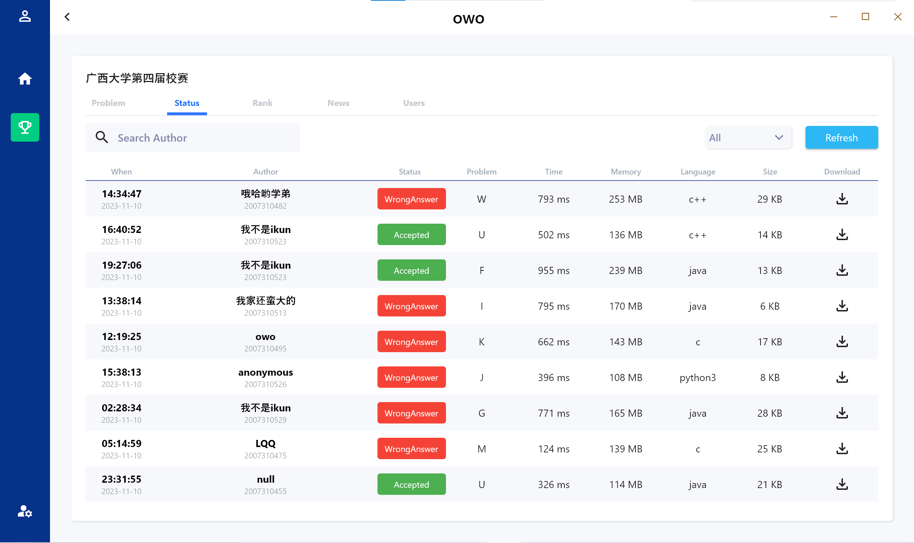
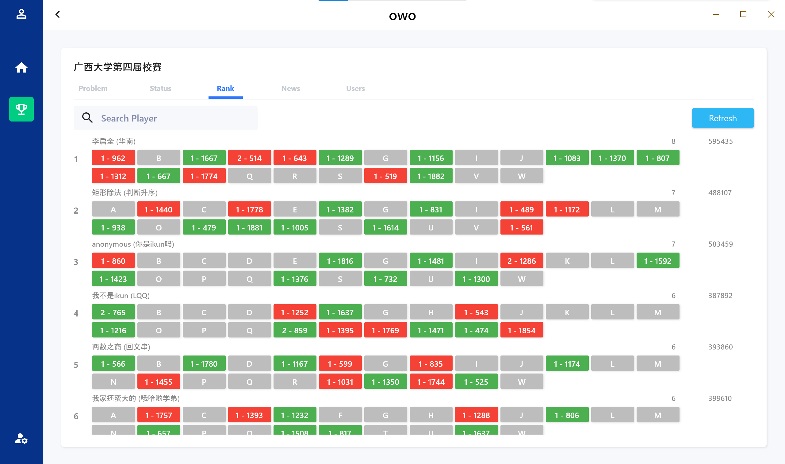
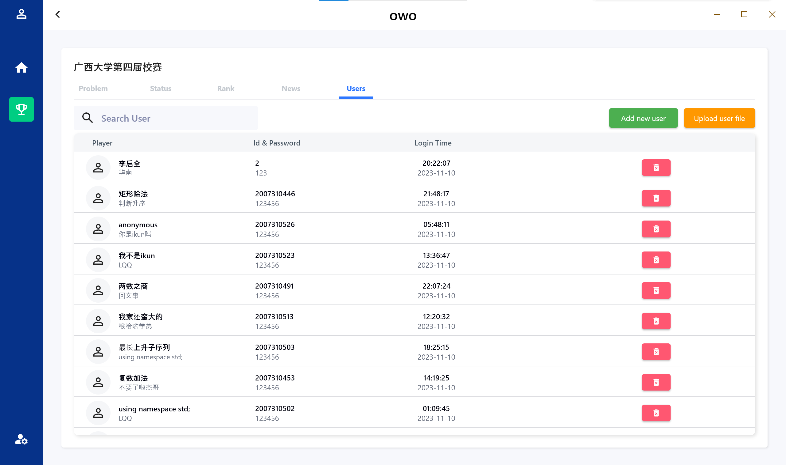

# owo
### 一款PC端的在线判题系统(由于缺乏调试设备，目前仅支持win10平台)，不依赖于浏览器，专为ACM-ICPC赛制准备。

目前[前端](https://github.com/LQQ4321/owo-user)已开发完成一大半，只剩下几个扩展功能没有实现，

# 一键部署(除了前端，其他全部需要运行在docker中，请提前安装好docker)

- 后端 由于目前前端仍然一部分扩展功能需要开发，所以一键部署的功能会推迟一些上线
- 前端 前端部分扩展功能待开发，开发完毕后，直接下载exe程序即可与后端交互

# 技术栈

- 前端      基于flutter框架设计界面
- 后端      使用golang转为开发语言
- 数据库    mysql8.0
- 数据缓存  redis
- 判题机    第三方包，[go-judge](https://github.com/criyle/go-judge/)

# 前端部分界面

